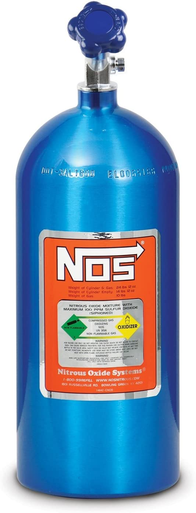

<div>
<h1> Protein Design with Guided Discrete Diffusion
  
[LaMBO](https://github.com/samuelstanton/lambo) + [NOS](https://github.com/ngruver/NOS)  = [LaMBO-2](https://github.com/ngruver/NOS) </h1>
</div>

<p align="center">
  
</p>

## Abstract

The recent success of diffusion models for images has led to their adoption in other continuous data modalities, notably protein structures. When combined with existing tools like classifier guidance, protein structure diffusion can be used to sample new protein structures with specific properties. Unfortunately, protein structure models are limited by the scarcity of high-quality structural data and often require an inverse model to convert structures into sequences for synthesis. By contrast, protein sequence data are plentiful, and designing directly in sequence space eliminates the need to recover sequence from structure. However, guidance methods from continuous diffusion are not directly applicable for the purpose due to the discrete nature of protein sequences. We propose new methods for discrete diffusion guidance, making it possible to optimize protein sequences for local and global properties while retaining high sequence likelihood. We apply our method to a real-world protein design task, optimizing antibodies for higher expression yield and binding affinity to a therapeutic target under locality and liability constraints, with 97% expression rate and 25% binding rate in exploratory in vitro experiments.

## Installation
```
pip install -r requirements.txt
```

To install ANARCI for sequence alignment, follow the instructions in the [official repo](https://github.com/oxpig/ANARCI). If you wish to recreate the [DiffAb](https://github.com/luost26/diffab) and [RFDiffusion](https://github.com/RosettaCommons/RFdiffusion) comparisons, these repos also contain their own dependencies. 

## Datasets

In order to obtain many SASA labels, we use [IgFold's archive of pre-computed structures on paired OAS (pOAS)](https://github.com/Graylab/IgFold#synthetic-antibody-structures). We extract the sequences and structures and labeled them by running the [labeling script](https://github.com/ngruver/NOS/blob/main/scripts/data/label_igfold_poas.py):
```
PYTHONPATH="." python scripts/data/label_igfold_poas.py
```
In order to used diffusion models with fixed dimension, we align the labeled sequences using a [wrapper script](https://github.com/ngruver/NOS/blob/main/scripts/data/align_igfold_poas.py) around ANARCI:
```
PYTHONPATH="." python scripts/data/align_igfold_poas.py
```
Finally, we choose [random test sequences](https://github.com/ngruver/NOS/blob/main/poas_seeds.txt), and remove any sequences with an overlapping heavy or light chain from the training dataset. 

For infilling-based sampling, our scripts expect space separated sequences with "\[MASK\]" denoting the infilling locations. An example can be found in the [test infill seed file](https://github.com/ngruver/NOS/blob/main/infill_test_seeds.txt). 

## Basic Usage

To train a sequence diffusion model without a discriminative head, you can run
```
PYTHONPATH="." python scripts/train_seq_model.py \
  model=[MODEL TYPE] \
  model.optimizer.lr=[MODEL LR] \
  data_dir=[DATASET DIRECTORY] \
  train_fn=[TRAINING CSV FILE] \
  val_fn=[VALIDATION CSV FILE] \
  vocab_file=[VOCAB FILE IN THIS REPO'S BASE DIR] \
  log_dir=[LOGGING DIRECTORY]
```
For the Gaussian corruption process (i.e. model="gaussian"), the additional argument should be set carefully:
```
  model.noise_schedule.noise_scale=[NOISE SCALE] \
```
This parameter effects the variance of the noise applied to the token embeddings. The noise schedule is unchanged, but the variance at each forward step, and the corresponding prior, is scaled multiplicatively. Reasonable defaults are in the range \[2, 10\]. 

To train a model with a discriminative head for K objectives (K=1 in our experiments), the following additional arguments are necessary:
```
  'target_cols=[[OBJECTIVE NAME 1], ..., [OBJECTIVE NAME K]]' \
  model.network.target_channels=[K] \
  discr_batch_ratio=[RATIO OF GENERATIVE LOSS UPDATES TO DISCRIMINATIVE] \
```

To perform basic sampling from a model, you can run
```
PYTHONPATH="." python scripts/sample.py
```

## Vanilla Infilling Experiments

To recreate the infilling experiments in section 5.1, there is a [script that wraps](https://github.com/ngruver/NOS/blob/main/scripts/infill/run_diffusion.py) the vanilla sampling code, creating seed files with "\[MASK\]"s for the desired CDRs and CDR numbering method. For example, given a train model checkpoint, one can run 
```
PYTHONPATH="." python scripts/infill/run_diffusion.py \
    model=[MODEL TYPE] \
    ckpt_path=[CKPT PATH] \
    +seeds_fn=[PATH TO poas_seeds.csv] \
    +results_dir=[RESULTS DIR] \
```

We also obtained infills from [DiffAb](https://github.com/luost26/diffab) and [RFDiffusion](https://github.com/RosettaCommons/RFdiffusion). After cloning these repos into this directory, the provide wrapper scripts for [DiffAb](https://github.com/ngruver/NOS/blob/main/scripts/infill/run_diffab.py) and [RFDiffusion](https://github.com/ngruver/NOS/blob/main/scripts/infill/run_rfdiffusion.py) can be used to sample infills and extract them into a consistent format. 

## Guidance Experiments

To recreate the experiments in section 5.2, we also provide a [wrapper script](https://github.com/ngruver/NOS/blob/main/scripts/control/sample_diffusion.py). As an example, guided infilling with continuous corruptions, optimizing for SASA, can be run with 
```
PYTHONPATH="." ./python-greene scripts/control/sample_diffusion.py \
    model=gaussian \
    model.network.target_channels=1 \
    ckpt_path=[CKPT PATH, MODEL TRAINED FOR SASA] \
    +guidance_kwargs.step_size=1.0 \
    +guidance_kwargs.stability_coef=0.01 \
    +guidance_kwargs.num_steps=10 \
    +seeds_fn=[PATH TO poas_seeds.csv] \
    +results_dir=[RESULTS DIR] \
```
For guided infilling with discrete corruptions, optimizing for percentage of beta sheets, try running
```
PYTHONPATH="." ./python-greene scripts/control/sample_diffusion.py \
    model=mlm \
    model.network.target_channels=1 \
    ckpt_path=[CKPT PATH, MODEL TRAINED FOR BETA SHEETS] \
    +guidance_kwargs.step_size=1.0 \
    +guidance_kwargs.stability_coef=0.01 \
    +guidance_kwargs.num_steps=10 \
    +seeds_fn=[PATH TO poas_seeds.csv] \
    +results_dir=[RESULTS DIR] \
```

We also provide our approximate [PPLM implementation](https://github.com/ngruver/NOS/blob/main/seq_models/model/autoregressive.py) and the [wrapper script](https://github.com/ngruver/NOS/blob/main/scripts/control/pplm.py) used for creating infills with PPLM. For the RFDiffusion and DiffAb diversification baselines we use samples obtained from the infilling wrapper scripts described above. 
